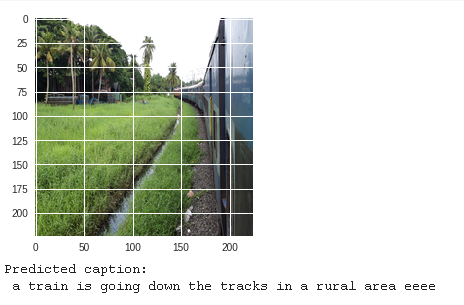
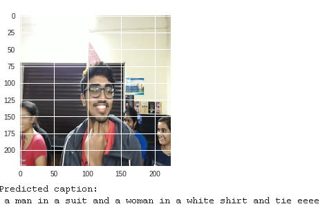
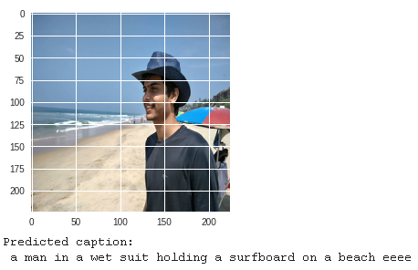
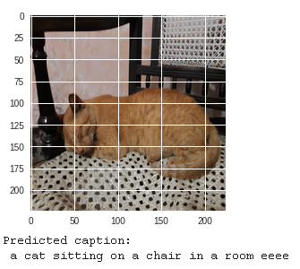
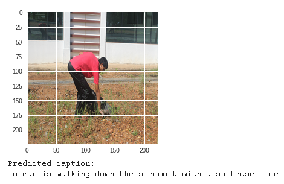

# RNN Caption Generator

This project is done by Arnab Karmakar, Abhinav Paul and Samvram Sahu, for fulfilment of course requirements of **AV494 - Deep 
Learning for Computational Data Sciences**, of seventh semester at **Indian Institute of Space Science and Technology**. The implementation and theory is discussed below.

Also the code is run on a collab notebook online for faster computation, and saving resources.

## Flow

We will use the VGG16 model that has been pre-trained for classifying images. But instead of using the last classification layer, we will redirect the output of the previous layer. This gives us a vector with 4096 elements that summarizes the image-contents - similar to how a "thought-vector" summarized the contents of an input-text in Tutorial #21 on language translation. We will use this vector as the initial state of the Gated Recurrent Units (GRU). However, the internal state-size of the GRU is only 512, so we need an intermediate fully-connected (dense) layer to map the vector with 4096 elements down to a vector with only 512 elements.

The decoder then uses this initial-state together with a start-marker "ssss" to begin producing output words. In the first iteration it will hopefully output the word "big". Then we input this word into the decoder and hopefully we get the word "brown" out, and so on. Finally we have generated the text "big brown bear sitting eeee" where "eeee" marks the end of the text.

## Results

Among the various input images for testing the trained model, we show the 6 images from in and around IIST which has been used to test, we paste the following screenshots

## Future work

The dataset is specefic for the North American continent and this is not an attention specefic RNN. Hence we can train the final work, on a much larger well labelled dataset.
We look forward to extend our horizon. Also we acknowledge the guidance of **Dr. Deepak Mishra**, without whose guidance we could not have realized this assignment.
